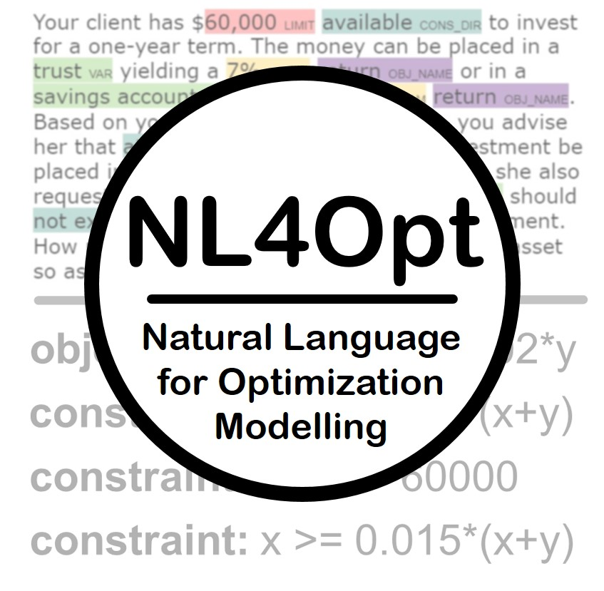

---
# Feel free to add content and custom Front Matter to this file.

# To modify the layout, see https://jekyllrb.com/docs/themes/#overriding-theme-defaults

layout: default
title: Welcome to the NL4Opt competition website

---

    
 

        

You can find the competition [rules](https://nl4opt.github.io/rules/) and answers to [commonly asked questions](https://nl4opt.github.io/faq/) on this website.

# News
## 2022-11-04
1. The winners have been tentatively announced (see [leaderboard](https://nl4opt.github.io/leaderboard/)). 
2. We require the winning teams to fill out the Google Form (sent via email) with information describing their submissions. 
3. All other teams are also encouraged to fill out the form, as submissions with enough novelty may be invited to submit a technical report.

## 2022-10-26
1. We will be announcing the winner on November 4th, the deadline for submitting your training scripts is set to be October 28th.

## 2022-09-16
1. We will be hosting two additional Zoom Q&A Sessions (focusing on subtask-2)

    * The first session will be on September 22nd 11am-12pm PST, the second session will be on September 22nd 10-11pm PST
    
    * Please check your email for links to both Zoom sessions

## 2022-08-25
1. Subtask-2's baseline has been updated to use `spans` instead of `obj_declaration` and `const_declaration` in the dictionaries. See [discussion 32](https://github.com/nl4opt/nl4opt-competition/discussions/32) for more details. Please pull this code if you are planning on using the baseline code.

## 2022-08-22
1. For subtask-1 baseline, default argument for `max_length` for input has been updated from `100` to `200`. You should also update this value for you own model. Please pull our latest version from [our repo](https://github.com/nl4opt/nl4opt-subtask1-baseline) if you plan on running the baseline code.
2. TBA: similar changes will announced for the baseline model for subtask-2

## 2022-08-18
1. Due to the problems with CUDA compatibility for older libraries, we have decided to switch the GPU instance for evaluation to RTX 6000 (14 vCPUs, 46 GiB RAM).
2. We have changed the evaluation schedule to two per week on __Wednesday__ and __Friday__, please ensure that your submission is uploaded to the Google Drive Folder by 8am [PST](https://time.is/PT) on the same days.

## 2022-08-09 Announcements
1. We have created an example submission folder on Google Drive ([Link](https://drive.google.com/drive/folders/18Rji40KTmKBMmkg_SbuUjsYciIIlrqEW?usp=sharing)) using the baseline models for both subtasks.
2. The slides from the Zoom Q\&A Sessions are available in the Competition Github Repo ([Link](https://github.com/nl4opt/nl4opt-competition/blob/main/NL4OPT_Q_A_Sessions.pdf))

## 2022-07-26 Announcements
1. We will begin evaluating the submissions for both tasks after July 26 12pm PST
    * GPU instance on Lambda Labs will be used to test your submissions, the instance has 1x A6000 (48GB) with 14 vCPUs, and 100 GiB RAM (You can test your script by creating an instance and running it on dev data). 

    * Please ensure your script finish execution in a reasonable amount of time (<10 min), and refrain from downloading unnecessarily large files to the local file system.

    * We will upload the shell output `evaluation.out` to your Google Drive directory, so you can debug your code before the next submission.

2. We will be hosting two Zoom Q&A Sessions

    * The first session will be on August 9th 1-2pm PST, the second session will be on August 9th 10-11pm PST
    
    * Please check your email for links to both Zoom sessions

## 2022-07-22 Announcements

1. Please check if your team has received an email with link to your Google Drive folder used for evaluating your submissions
    * More instructions for the evaluations on the test set will be available in the upcoming week

    * If you received more than one email with different Google Drive links, please check and use the one that is accessible to you.

2. __Revisions for Sub-task 1 dataset__: As described in the [Data repository](https://github.com/nl4opt/nl4opt-competition), we have removed white space tokens from the NER dataset. The held-out test set has also been updated to the same format.

## 2022-07-05 Announcements

1. The data and starter-kits have been released!
    * [Data repository](https://github.com/nl4opt/nl4opt-competition)

    * [Sub-task 1 repository](https://github.com/nl4opt/nl4opt-subtask1-baseline)

    * [Sub-task 2 repository](https://github.com/nl4opt/nl4opt-subtask2-baseline)
2. The organizers are planning to host a Q&A session by the end of the month. If you are running into issues with your submission or have any other questions, please feel free to join us. More details will be shared closer to the date! 

3. Keep an eye out on your email for the instructions for submission in the upcoming week! The submission portal opens on July 15th. 

# Important Dates

The following dates use the [anywhere on earth (AoE)](https://www.timeanddate.com/time/zones/aoe) time zone:

| Event                                                                                                                                    | Date                |
| ---------------------------------------------------------------------------------------------------------------------------------------- | ------------------- |
| **Competition kickoff.** The registration is opened and participants can download the starterkit and the training/validation datasets.   | July 1st, 2022      |
| **Submission available.** The leaderboard and forum are opened, and the submissions are accepted.                                        | July 15th, 2022     |
| **Deadline for registration**                                                                                                            | October 8th, 2022   |
| **Deadline for submission.**                                                                                                             | October 15th, 2022  |
| **Winners notification.** Winning teams are notified and instructed to provide information that will be included in the workshop report. | November 4th, 2022  |
| **Report submission deadline.**                                                                                                          | November 20th, 2022 |
| **NeurIPS competition workshop.**                                                                                                        | December 2022       |

# Introduction

The Natural Language for Optimization (NL4Opt) NeurIPS 2022 competition aims to improve the accessibility and usability of optimization solvers. The task of converting text description of a problem into proper formulations for optimization solvers can often be time-consuming and require an optimizations research expert. The participants will investigate methods of automating this process to be more efficient and accessible to non-experts. This competition aims to answer the following question: *can learning-based natural language interfaces be leveraged to convert linear programming (LP) word problems into a format that solvers can understand?*

This competition presents **two challenges for ML:** (1) detect problem entities from the problem description and (2) generate a precise meaning representation of the optimization formulation.

# Challenges

The competition is split into two main tasks that are related, but tackled independently. Participants can compete in any subset of these two challenges and the 5 best winning submissions of each task will be awarded (see the Prizes Section below).

The two inter-related tasks are to find an intelligent solution to:

1. detect problem entities from the problem statement,

2. generate a precise meaning representation of the optimization formulation.

## Sub-task 1 - named entity recognition

**The goal of this task** is to recognize the label the semantic entities that correspond to the components of the optimization problem. The solutions of the task will take as input an optimization description as a word problem that describes the decision variables, the objective, and a set of constraints. The multi-sentence word problem input exhibits a high level of ambiguity due to the variability of the linguistic patterns, problem domains, and problem structures. **This first task aims to reduce the ambiguity by detecting and tagging the entities of the optimization problems** such as the objective name, decision variable names, or the constraint limits. This is a preliminary step to simplify the second sub-task and can be seen as a preprocessing task.

**Metric:** F1 score

**Relevant resources:**

- [Review Article - Chinese Named Entity Recognition](https://doi.org/10.1016/j.neucom.2021.10.101 "Persistent link using digital object identifier"). Liu et al., *Neurocomputing*, 2022,

- [A Survey on Deep Learning for Named Entity Recognition](https://doi.ieeecomputersociety.org/10.1109/TKDE.2020.2981314). Li et al., *IEEE Transactions on Knowledge and Data Engineering*, 2022,

- [MultiCoNER Competition](https://multiconer.github.io/). *SemEval 2022 Task 11.*

- [Hugging Face Tutorial.](https://huggingface.co/course/chapter0/1?fw=pt) *Hugging Face.*

- [PyTorch Tutorial - Named Entity Recognition Tagging](https://cs230.stanford.edu/blog/namedentity/). *Stanford Blog.*

- [Keras Tutorial - Named Entity Recognition using Transformers](https://keras.io/examples/nlp/ner_transformers/). *Keras.*

- [Tutorial - How to Fine-Tune BERT for Named Entity Recognition (NER)](https://skimai.com/how-to-fine-tune-bert-for-named-entity-recognition-ner/). *Skimai.*

## Sub-task 2 - generating the precise meaning representation

**The goal of this task** is to take as input the problem description, the labeled semantic entities, and the order mapping of variable mentions and formulate the precise meaning representation. This meaning representation will be converted into a format that solvers can understand. The solutions will be evaluated on the canonical form and conversion scripts from our pilot study has been released as part of the starter kit. We welcome you to create your own meaning representation or use the representation and conversion scripts provided in the starter kit.

**Metric:** Declaration-level mapping accuracy

**Relevant resources:**

- [Natural Language Processing with Transformers: Building Language Applications with Hugging Face.](https://www.amazon.ca/Natural-Language-Processing-Transformers-Applications/dp/1098103246) Tunstall et al., *(O’Reilly Media, 2022)*

- [Hugging Face Tutorial.](https://huggingface.co/course/chapter0/1?fw=pt) *Hugging Face.*

- [Using different decoding methods for language generation with Transformers.](https://colab.research.google.com/github/huggingface/blog/blob/main/notebooks/02_how_to_generate.ipynb) Alexander et al., *(Colab notebook).*

- [Constrained Language Models Yield Few-Shot Semantic Parsers.](https://aclanthology.org/2021.emnlp-main.608.pdf) Shin et al., *ACL Anthology.*

- [The Power of Prompt Tuning for Low-Resource Semantic Parsing.](https://arxiv.org/abs/2110.08525) Schucher et al., *arXiv.*

- [Text-to-Table: A New Way of Information Extraction.](https://aclanthology.org/2022.acl-long.180.pdf) Wu et al., *ACL Anthology.*

- [CodeBERT: A Pre-Trained Model for Programming and Natural Languages.](https://aclanthology.org/2020.findings-emnlp.139/) Feng et al., *Findings of the Association for Computational Linguistics: EMNLP 2020.*

- [Few-Shot Semantic Parsing with Language Models Trained On Code.](https://arxiv.org/abs/2112.08696) Shin et al., *arXiv.*

- [PICARD: Parsing Incrementally for Constrained Auto-Regressive Decoding from Language Models.](https://aclanthology.org/2021.emnlp-main.779/) Scholak et al., *ACL Anthology.*

**For more information** regarding the type of data in each sub-task and the resources provided to help you get started, visit the [Getting Started](https://nl4opt.github.io/gettingstarted/) page of our website.

# Metrics

**Sub-task 1 (named entity recognition):** The solutions will be evaluated on their achieved micro-averaged F1 score:

$$\text{F1} ={2\times P \times R \over P+R},$$

where $$P$$ and $$R$$ are the average precision and average recall averaged over all entity types, respectively.

**Sub-task 2 (generation):** The solutions will be evaluated using an application-specific metric since the task is motivated by the need to precisely formulate the optimization problem. The models will be benchmarked based on the declaration-level mapping accuracy given by:

$$\text{Acc} = 1-\frac{\sum_{i=1}^N\text{FP}_{i} + \text{FN}_i}{\sum_{i=1}^{N}D_{i}},$$

where $$N$$ is the number of LP problems in the test set. For each LP problem $$i$$, $$D_{i}$$ is the number of ground-truth declarations. The false positive $$\text{FP}_{i}$$ is the number of non-matched predicted declarations whereas the false negative $$\text{FN}_{i}$$ denotes the number of excess unmatched ground-truth declarations. In other words, false negatives are counted when there are more ground-truth declarations than predicted declarations. A false positive is counted when there is a predicted declaration that does not match any ground-truth declaration.

# Prizes

A total monetary prize of $22,000 USD will be awarded. The 5 best winning submissions of each task will be awarded the following prizes:

- **1st place:** $6,000

- **2nd place:** $3,000

- **3rd place:** $1,000

- **4th and 5th place:** $500

All participants will receive a certificate of participation. Winners will be invited to give talks at the workshop.
