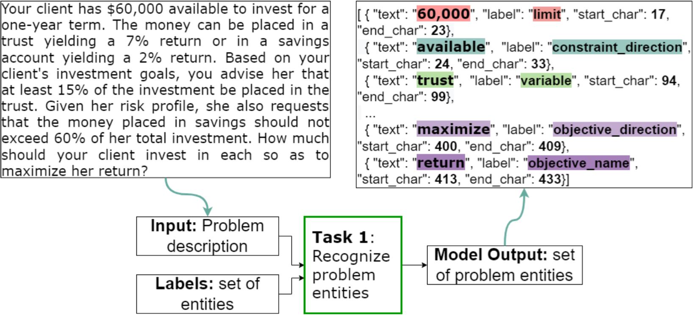
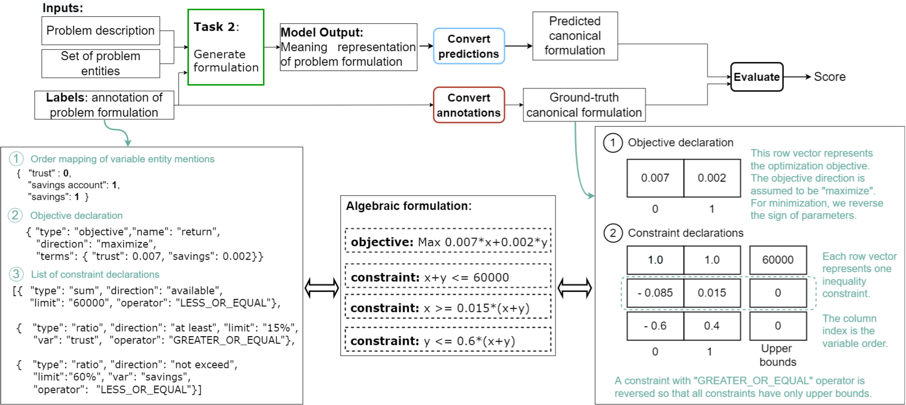

# Tutorial

This tutorial page goes through the process to register and submission. It then gives a tutorial on how to set up the baseline of each subtask.

If you have further questions, we encourage you to refer to the [FAQ page](https://nl4opt.github.io/faq/) and use our [forum](https://github.com/nl4opt/nl4opt-competition/discussions) for discussion.

# 1. Registration

To register for this competition, head to the [Participate page](https://nl4opt.github.io/participate/) and follow the instructions. Please read through the competition rules before you accept to abide by them. After completing and submitting the form, your team will receive an email in the "team" email address provided in the first page of the registration form. Confirm the contents of your submission by double-checking the table attached in the email. If the contents are incorrect, you may edit the response of your registration following a link provided in the email. The "Team Name" field is the text used to identify your submission and publish to the leaderboards.

# 2. Submission

After your registration, within two work days (PST), you will receive an email with instructions for the submission protocol and a link to a cloud storage folder accessible only by the organizers and your team. You will upload your scripts and transformers or language models to this folder and they will be evaluated every Monday and Friday (PST) throughout the competition.

# 3a. Subtask-1 (NER) Baseline Tutorial

<div class="figure">
    
    Overview of how our baseline model generates predictions for subtask 1.
</div>

Subtask-1 (NER) Baseline Tutorial

This pretrained baseline transformer model is adapted from a [popular NER competition](https://multiconer.github.io/) that leverages the XLM-RoBERTa-base model.

## Setting up the code environment

### Clone the repo from git

Run the following command to clone the repository containing the scripts to create the baseline model. The relevant scripts will be in the directory ./baseline whereas data for the competition is under the directory ./data.
`git clone https://github.com/nl4opt/nl4opt-subtask1-baseline.git`

### Setting up environment using conda

Create a conda environment for the NER task and install the required packages: 

`conda create --name nl4opt-ner python=3.9.12`

`conda activate nl4opt-ner`

`cd nl4opt-subtask1-baseline/ner_task/baseline` 

`pip install -r requirements.txt`

## Overview for Running the code for the NL4Opt Baseline

This code repository provides you with baseline approach for Named Entity Recognition (NER). In this repository the following functionalities are provided:

- CoNLL data readers
- Usage of any HuggingFace pre-trained transformer models
- Training and Testing through Pytorch-Lightning

Please see below for a more detailed description on how to use this code is provided.

### Arguments:

The arguments are as follows:

- `--train` points to the path of the training data. In the case of the baseline model, this would be ../data/train/train.txt
- `--dev` points to the path of the training data. In the case of the baseline model, this would be ../data/dev/dev.txt
- `--out_dir` points to the path to save the output files.
- `--iob_tagging` can be adjusted if the tagging scheme is altered. However, this must be converted back to the 'conll' tagging scheme prior to evaluation.
- `--max_instances` is the maximum number of instances - we recommend to keep this untouched.
- `--max_length` is the maximum number of tokens per instance - we recommend to keep this untouched.
- `--encoder_model` is the pretrained encoder to select. The baseline model was trained on xlm-roberta-base but there are many others to choose from.
- `--model` is the path to the model. This is used for fine-tuning and evaluation.
- `--model_name` is name to save your model under.
- `--stage` is the stage of training. Either 'fit', 'validate', 'test', or 'predict'.
- `--prefix` is the prefix for storing evaluation files.
- `--batch_size` is the number of samples in a batch.
- `--epochs` is the number of epochs to train for.
- `--lr` is the learning rate.
- `--dropout` is the dropout rate used.
- `--gpus` is the number of gpus to use.
- `--cuda` is the cuda device.
- `--epochs` is the number of epochs to train for.
- `--accum_grad_batches` is the number of batches before accumlating gradients.

```
p.add_argument('--train', type=str, help='Path to the train data.', default=None)
p.add_argument('--dev', type=str, help='Path to the dev data.', default=None)

p.add_argument('--out_dir', type=str, help='Output directory.', default='.')
p.add_argument('--iob_tagging', type=str, help='IOB tagging scheme', default='conll')

p.add_argument('--max_instances', type=int, help='Maximum number of instances', default=1500)
p.add_argument('--max_length', type=int, help='Maximum number of tokens per instance.', default=200)

p.add_argument('--encoder_model', type=str, help='Pretrained encoder model to use', default='xlm-roberta-large')
p.add_argument('--model', type=str, help='Model path.', default=None)
p.add_argument('--model_name', type=str, help='Model name.', default=None)
p.add_argument('--stage', type=str, help='Training stage', default='fit')
p.add_argument('--prefix', type=str, help='Prefix for storing evaluation files.', default='test')

p.add_argument('--batch_size', type=int, help='Batch size.', default=64)
p.add_argument('--accum_grad_batches', type=int, help='Number of batches for accumulating gradients.', default=1)
p.add_argument('--gpus', type=int, help='Number of GPUs.', default=1)
p.add_argument('--cuda', type=str, help='Cuda Device', default='cuda:0')
p.add_argument('--epochs', type=int, help='Number of epochs for training.', default=5)
p.add_argument('--lr', type=float, help='Learning rate', default=1e-5)
p.add_argument('--dropout', type=float, help='Dropout rate', default=0.1)
```

## Train and evaluate the model

Execute the following commands to train, fine-tune, and evaluate the model on the development set. Participants will not have access to the test set that is used for model evaluation and leaderboard updates.

There are many approaches to training a neural network. However, the baseline framework provided does this in a two-step approach: first with a training session where the model is trained with early stopping; second with a fine-tuning session (potentially with a lower LR, or adaptive LR etc).

### Training the model

`python train_model.py --train ../data/train/train.txt --dev ../data/dev/dev.txt --out_dir ./trained_model --model_name xlmr_lr_0.0001 --gpus 1 --epochs 25 --encoder_model xlm-roberta-base --batch_size 64 --lr 0.0001`

### Fine-tuning the model

`python fine_tune.py --train ../data/train/train.txt --dev ../data/dev/dev.txt --out_dir ./trained_model --model_name xlmr_lr_0.0001 --gpus 1 --epochs 30 --encoder_model xlm-roberta-base --batch_size 64 --lr 0.0001 --model ./trained_model/xlmr_lr_0.0001/lightning_logs/version_0`

### Evaluating the model on the dev set

`python evaluate.py --test ../data/test/20220629-test.txt --out_dir ./trained_model --model_name xlmr_lr_0.0001 --gpus 1 --encoder_model xlm-roberta-base --batch_size 64 --model ./trained_model/xlmr_lr_0.0001/lightning_logs/version_1`

## Results

*When evaluating the baseline on the dev set, you should get a micro-averaged F1 score of 0.886.*

The model was evaluated on researved samples from the same domain as those released as part of the "training split" ("Source Domain"). The model was then evaluated on the reserved three new domains containing transportation, production, and science problems ("Target Domain"). Finally, the model was evaluated on the entire test set made up of all reserved sampled described above ("Entire Test Set"). The leaderboard and final standings will only consider the micro-averaged F1 score (right-most column) of the submitted models on the entire test set. The baseline model achieved **micro-averaged F1 score of 0.889**. This model achieved the following F1 scores:

|                         | CONST  <br>DIR | LIMIT | OBJ  <br>DIR | OBJ  <br>NAME | PARAM | VAR   | MICRO  <br>AVG |
| ----------------------- | -------------- | ----- | ------------ | ------------- | ----- | ----- | -------------- |
| **Source Domain<br>**   | 0.858          | 0.867 | 1.000        | 0.903         | 0.949 | 0.903 | 0.906          |
| **Target Domain<br>**   | 0.828          | 0.922 | 0.877        | 0.045         | 0.906 | 0.850 | 0.816          |
| **Entire Test Set<br>** | 0.880          | 0.950 | 0.947        | 0.362         | 0.972 | 0.915 | 0.889*         |

\* Value that will be reported on the leaderboards page and used for the final evaluation when determining the winners.

# 3b. Subtask-2 (Generation) Baseline Tutorial

<div class="figure">
    
    Overview of how our baseline model generates predictions for subtask 2.
</div>

In the starter kit, you will find the files required to train a baseline model using BART.

## Environment Setup

We have provided a Conda environment file `environment.yml`. To install:

```
conda env create -f environment.yml
conda activate myenv
```

Verify that it was installed:

```
conda env list
```

## Training

The subfolder `./configs` should contain the configuration file for setting up the model configuration and the training hyperparameters. The configuration file `baseline.json` corresponds to the baseline model for subtask 2. To run the training with our configuration:

```
python train.py --config configs/baseline.json
```

The important parameters here are `use_copy`, `per_declaration`,  and `use_prompt`. 

- `use_copy` uses a copy mechanism that computes $P_\text{copy}$ over the input tokens. 
- `per_declaration` controls each training data sample to correspond to a single declaration of a given LP problem instead of the entire formulation (i.e. all declarations in the problem).
- `use_prompt` uses a declaration prompt to focus the generation. For example, the `<OBJ_DIR>` is used as a prompt for generating the objective declaration.

Note that beam search is available as an alternative to greedy search in decoding; however, we found that greedy search worked better.

## Testing

To evaluate the model:

```
python test.py --gpu <gpu id> --checkpoint <checkpoint.mdl> --test-file <test.jsonl>
```

More details about scoring can be found in the `notebooks` folder [here](https://github.com/nl4opt/nl4opt-subtask2-baseline/tree/main/notebooks). For reference, our baseline model achieves a per-declaration accuracy of `Acc = 0.61` on the test set. Note however that the test set is held out and will not be shared to participants.

For more details, see the README for [subtask-2](https://github.com/nl4opt/nl4opt-subtask2-baseline) for a tutorial on training a baseline BART model.
